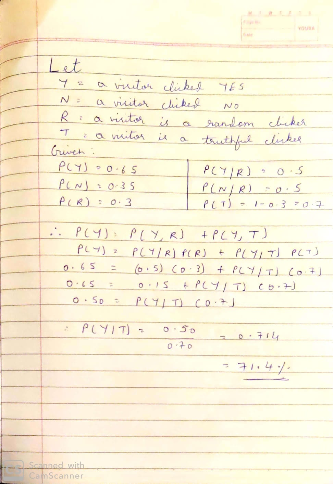
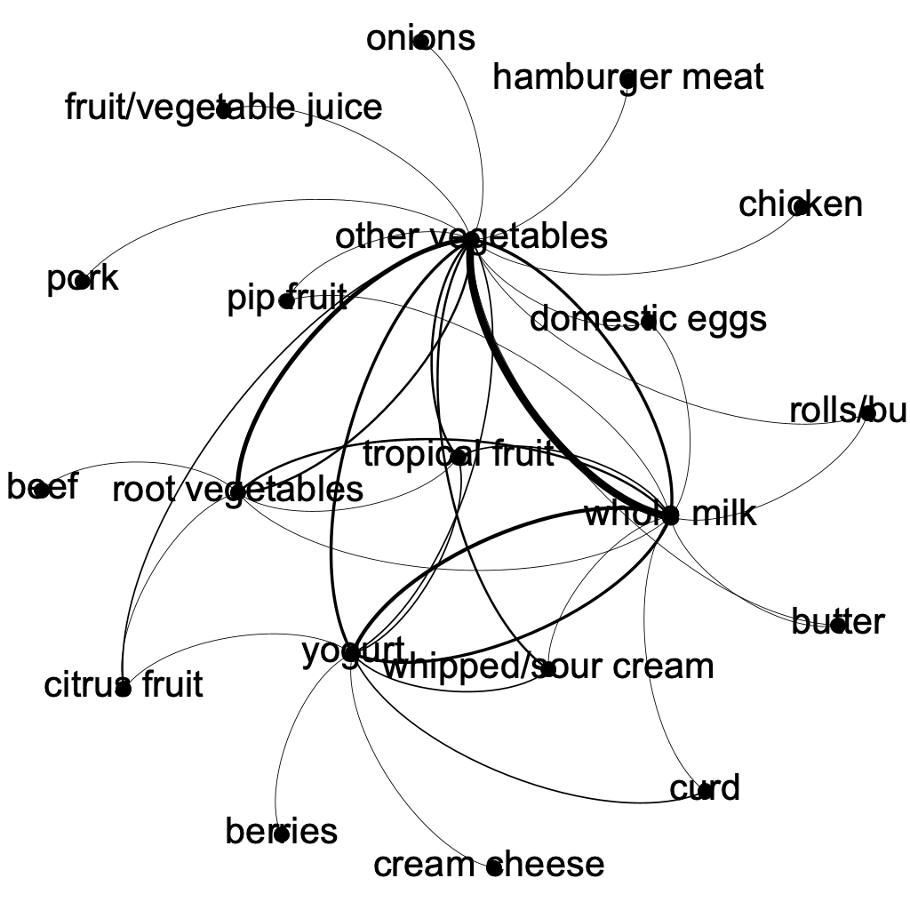

**Title**: STA 380N Intro to ML Take Home Exam 2

**Author**: Samarth Mishra (sm79247), Muskan Agarwal (ma64547), Sreekar Lanka (sl54387), Rishabh Tiwari (rt27739)

**Date** : 2022-08-15

**Output** : pdf_document

**GitHub Repository Link** : https://github.com/smjohn98/STA380_Take-Home-Exam-2

# Probability Practice

**Part A - 71.4%**



**Part B - 19.9%**


# **Wrangling the Billboard Top 100**

```{r echo=FALSE,warning=FALSE}
# Reading the billboard.csv file
billboard=read.csv("https://raw.githubusercontent.com/dpuelz/STA380/master/data/billboard.csv")
```

**Part A:**

```{r echo=FALSE, warning=FALSE}
library(dplyr)
library(tidyverse)
library(kableExtra)
most_popular_songs=billboard %>%
  group_by(performer,song) %>%
  summarize(count=n(), .groups = 'drop') %>%
  arrange(desc(count)) %>%
  head(10)
knitr::kable(most_popular_songs, col.names = c("Performer","Song","Count"))
```

Imagine Dragons's Radioactive was the most popular song since 1958, appearing on the Billboard Top 100 for a total of 87 weeks.

**Part B:**

```{r echo=FALSE, warning=FALSE}
billboard %>%
filter(year!=1958 & year!=2021) %>% # Filtering out the years 1958 and 2021
group_by(year) %>%
summarize(musical_diversity=length(unique(song)))%>%
ggplot(aes(x = year, y = musical_diversity))+
geom_line()
labs(x = "Year", y = "Musical Diversity",caption="The musical diversity peaked in 1970 with about 800 unique songs that appeared in the Billboard Top 100. The musical diversity then decreased steadily, almost halfing in the beginning of the 21st century. The musical diversity has been continuously increasing since then reaching 1970 levels in 2020")
```

**c) Part C**

```{r echo=FALSE, warning=FALSE}
# Filtering out the 10-week hit songs
ten_week_hit = billboard %>%
  group_by(performer, song) %>%
  summarize(week_hits = n(), .groups='drop') %>%
  filter(week_hits >= 10)
# Filtering out artists who had at least 30 songs that were 10 week hits
dat = artist_at_least_thirty_ten_week_hits=ten_week_hit %>%
group_by(performer) %>%
summarize(count_10_week_hits= n()) %>%
filter(count_10_week_hits >= 30)
#print(dim(artist_at_least_30_ten_week_hits))
plt1 = ggplot(dat, aes(x = performer, y = count_10_week_hits))+
geom_col()+
coord_flip()+
labs(x = "Performer", y = "No of 10 week hits")
#artist_at_least_thirty_ten_week_hits
plt1
```

# **Visual story telling part 1: green buildings**

Loading the libraries and reading the csv

```{r, echo = FALSE, warning=FALSE}

library(dplyr)
library(mosaic)
library(tidyverse)
raw_buildings_data <-read.csv('https://raw.githubusercontent.com/jgscott/STA380/master/data/greenbuildings.csv')
```

Converting categorical columns to numerical

```{r, echo = FALSE, warning=FALSE}

raw_buildings_data$renovated <- as.factor(raw_buildings_data$renovated )
raw_buildings_data$class_a <- as.factor(raw_buildings_data$class_a )
raw_buildings_data$class_b <- as.factor(raw_buildings_data$class_b )
raw_buildings_data$LEED <- as.factor(raw_buildings_data$LEED )
raw_buildings_data$Energystar <- as.factor(raw_buildings_data$Energystar )
raw_buildings_data$green_rating <- as.factor(raw_buildings_data$green_rating )
raw_buildings_data$amenities <- as.factor(raw_buildings_data$amenities )
raw_buildings_data$net <- as.factor(raw_buildings_data$net )

```

Creating a new column for class

```{r, echo = FALSE, warning=FALSE}
raw_buildings_data$class <- ifelse(raw_buildings_data$class_a == 1,'A',ifelse(raw_buildings_data$class_b == 1,'B','C'))
```

Verifying first condition told by the guru

```{r, echo = FALSE, warning=FALSE}
raw_buildings_data %>% filter(leasing_rate >10)%>%group_by(green_rating)%>%summarise(med_rent = median(Rent),  mean_rent = mean(Rent), count = n())
```

**From above we can notice that the rent per square foot is more for buildings which have green rating**

Plotting the data on a box plot to check for outliers:

```{r, echo = FALSE, warning=FALSE}
ggplot(raw_buildings_data, aes(green_rating, Rent)) + geom_boxplot()
```

**From the above box plot we notice that non - green buildings have more outliers hence it was a good decision by guru to take the median of the rent rather than mean.**

Let us compare few variables below to cross check with the findings of guru

Age vs leasing rates

```{r, echo = FALSE, warning=FALSE}

ggplot(raw_buildings_data, aes(age,leasing_rate, color= green_rating)) + geom_point()

```

**There does not seem to be any relationship between these two variables**

green_building vs leasing rate

```{r, echo = FALSE, warning=FALSE}
ggplot(raw_buildings_data, aes(leasing_rate, Rent, color = green_rating)) + geom_point()
```

**Here we can notice that until 70% the leasing rate does not vary too much but once it crosses 70% it starts increasing.**

Let us check if their is any connection between the leasing rate of different types of buildings

```{r, echo = FALSE, warning=FALSE}
raw_buildings_data %>% group_by(green_rating)%>%summarise(median_rate = median(leasing_rate), count = n())
```

**Here from the table we can notice that the leasing rate is higher for green buildings but I think it will be hard to verify this because we have small amount of data. Therefore guru's concept of 90% occupancy seems to be aligned with the data.**

**Search for confounding factors:**

1)  Size

```{r, echo = FALSE, warning=FALSE}

raw_buildings_data%>%group_by(green_rating)%>%summarise(median_size = median(size), count = n())
```

**From above table we can analyze that green buildings have larger area so it can be a good confounding factor.**

Lets have a look at the plot:

```{r, echo = FALSE, warning=FALSE}
ggplot(raw_buildings_data, aes(size,Rent,color = green_rating)) + geom_point()
```

**From the plot we can see that as he size increases the rent also increases.**

2)  Amenities

```{r, echo = FALSE, warning=FALSE}
raw_buildings_data%>%group_by(green_rating, amenities)%>%summarise(median(Rent),count=n())
```

**There is no deviation in the rent whether the amenities are included or not. So this cannot be a confounding variable.**

3)  Age

```{r, echo = FALSE, warning=FALSE}
raw_buildings_data%>%group_by(green_rating)%>%summarise(median(Rent),median(age),count=n())
```

**There is no deviation in the rent with respect to the age of the building. Hence it cannot be a confounding variable**

Let us plot it and observe for any trend

```{r, echo = FALSE, warning=FALSE}
ggplot(raw_buildings_data, aes(age,Rent,color = green_rating)) + geom_point()
```

**There is not possible trend that can be observed from the plot**

4)  Stories

```{r, echo = FALSE, warning=FALSE}

raw_buildings_data%>%group_by(green_rating)%>%summarise(median(stories),median(Rent), count= n())
```

**Green buildings tend to have one floor extra but there is not difference between in the median rent**

Let us look at the plot

```{r, echo = FALSE, warning=FALSE}
ggplot(raw_buildings_data, aes(stories,Rent, color = green_rating)) + geom_point()
```

**As per the plot we can notice that there is slight increase as you increase number of stories**

**Recommendations :**

```{r, echo = FALSE, warning=FALSE}
raw_buildings_data%>%filter(cluster>=430 & cluster<=600)%>%group_by(green_rating)%>%summarise(median(Rent), count= n())
```

Lets look at the plot

```{r, echo = FALSE, warning=FALSE}
ggplot(raw_buildings_data, aes(cluster, Rent, color = green_rating)) + geom_point()
```

There is a difference of \$5 between green and non-green buildings for clusters 430 - 600, possibly due to increased environmental awareness. We could thus generate an additional revenue of \$5 \* 250,000 = \$1.25 million per year

**Key Takeaways :**

-   There is an additional \$2.6 in revenue for green buildings and it goes upto\$5 for clusters 430 - 600.

-   There is a positive relatio bwtween rent and occupancy rates. Green buildings have a better rate of occupancy

-   There is no relation between age and occupancy rates.

-   Also we found that rent and size have a subtle positive relationship. Green buildings 100,000 sq. ft. larger than non-green buildings, so this can be a confounding factor.

Guru's assumptions of being able to recuperate costs in around 8-9 years seems to be true. The average age for green buildings is currently 22 years, as the popularity of green buildings increase, we expect them to age and thus, the guru's assumption that the building would generate revenue for 30 years holds true.

# **Visual story telling part 2: Capital Metro data**

```{r echo=FALSE, warning=FALSE}

#Reading the CapMetro csv file
capmetro=read.csv("https://raw.githubusercontent.com/dpuelz/STA380/master/data/capmetro_UT.csv")
#print(capmetro)
```

```{r echo=FALSE, warning=FALSE}
# Extracting the data for average boarding happening every hour
avg_boarding_every_hour = capmetro %>% 
  group_by(hour_of_day, day_of_week) %>%
  summarise(avgboarding = mean(boarding), .groups='drop') %>% 
  arrange(day_of_week)

#avg_boarding_every_hour
ggplot(avg_boarding_every_hour) +
  geom_line(aes(y=avgboarding, x= hour_of_day))+
  facet_wrap(~day_of_week)+
labs(title = "Capital Metro Boarding",y = "Average Boarding",x = "Time",caption="The boarding steadily increases after 6:00 on all working days peaking at around 15:00-16:00 while being very low on weekends")
```

```{r echo=FALSE, warning=FALSE}
#Extracting the data for average alighting every hour
avg_alighting_every_hour = capmetro %>% 
  group_by(hour_of_day, day_of_week) %>%
  summarise(avg_alighting = mean(alighting), .groups='drop') %>% 
  arrange(day_of_week)
```

```{r echo=FALSE, warning=FALSE}
#avg_alighting_every_hour
ggplot(avg_alighting_every_hour) +
  geom_line(aes(y=avg_alighting , x= hour_of_day))+
  facet_wrap(~day_of_week)+
labs(title = "Capital Metro Alighting",y = "Average Alighting",x = "Time",caption="The alighting steadily increases after 6:00 peaking at around 8:00-9:00 on all weekdays while being very low on weekends")
```

```{r echo=FALSE, warning=FALSE}
ggplot(data=capmetro,aes(x=temperature,y=boarding))+
  geom_point() +
  labs(title = "Boarding vs Temperature",y = "Boarding",x = "Temperature",caption="From the scatter plot above, the boarding looks independent of the temperature")
```

```{r echo=FALSE, warning=FALSE}
ggplot(data=capmetro,aes(x=temperature,y=alighting))+
  geom_point() +
  labs(title = "Alighting vs Temperature",y = "Alighting",x = "Temperature",caption="From the scatter plot above, the alighting also looks independent of the temperature")
```

# Portfolio Modeling

**Safe Portfolio (Low Risk ETF's)**

VOO - Vanguard 500 Index Fund ETF - Invests in stocks in the S&P 500 Index, representing 500 of the largest U.S. companies

SCHA - Schwab US Small-Cap ETF - The fund's goal is to track as closely as possible, before fees and expenses, the total return of the Dow Jones U.S. Small-Cap Total Stock Market Index.

VXUS - Vanguard Total International Stock Index Fund ETF - Seeks to track the performance of the FTSE Global All Cap ex US Index, which measures the investment return of stocks issued by companies located outside the United States

VWO - Vanguard Emerging Markets Stock Index Fund ETF - Invests in stocks of companies located in emerging markets around the world, such as China, Brazil, Taiwan, and South Africa.

AOR - iShares Core Growth Allocation ETF - The investment seeks to track the investment results of the S&P Target Risk Growth Index composed of a portfolio of underlying equity and fixed income funds intended to represent a growth allocation target risk strategy.

**High Risk ETF's**

TQQQ- ProShares UltraPro QQQ - The index includes 100 of the largest domestic and international non-financial companies listed on The Nasdaq Stock Market based on market capitalization.

QLD - ProShares Ultra QQQ - ProShares Ultra QQQ seeks daily investment results, before fees and expenses, that correspond to two times (2x) the daily performance of the Nasdaq-100 Index

SPXL - Direxion Daily S&P 500 Bull 3X Shares - The Direxion Daily S&P 500^®^ Bull (SPXL) and Bear (SPXS) 3X Shares seeks daily investment results, before fees and expenses, of 300%, or 300% of the inverse (or opposite), of the performance of the S&P 500^®^ Index.

SPUU - Direxion Daily S&P 500 Bull 2X Shares ETF - The Direxion Daily S&P 500^®^ Bull 2X Shares seeks daily investment results, before fees and expenses, of 200% of the performance of the S&P 500^®^ Index.

SWAN - BlackSwan ETF - The BlackSwan ETF seeks investment results that correspond to the S-Network BlackSwan Core Index (the Index)

NTSX - WisdomTree U.S. Efficient Core Fund - The WisdomTree U.S. Efficient Core Fund\* seeks total return by investing in large-capitalization U.S. equity securities and U.S. Treasury futures contracts.

**Medium Risk ETF's (Combination of High Risk and Safe ETF's)**

```{r, echo = FALSE, warning=FALSE}
library(mosaic)
library(quantmod)
library(foreach)

# Import sets of  ETFs
safe_pf = c("VOO", "SCHA", "VXUS", "VWO", "AOR")
high_pf = c("TQQQ","QLD","SPXL","SPUU","SWAN","NTSX")
med_pf = c("VOO","SCHA","VXUS","SPUU","SWAN","NTSX")

safe_pf.data = getSymbols(safe_pf, from = "2014-01-01")
high_pf.data = getSymbols(high_pf, from = "2014-01-01")
med_pf.data = getSymbols(med_pf, from = "2014-01-01")
```

```{r, echo = FALSE, warning=FALSE}
#adjust for  splits and dividents 

VOOa <- adjustOHLC(VOO)
SCHAa <- adjustOHLC(SCHA)
VXUSa <- adjustOHLC(VXUS)
VWOa <- adjustOHLC(VWO)
AORa <- adjustOHLC(AOR)


TQQQb <- adjustOHLC(TQQQ)
QLDb <- adjustOHLC(QLD)
SPXLb <- adjustOHLC(SPXL)
SPUUb <- adjustOHLC(SPUU)
SWANb <- adjustOHLC(SWAN)
NTSXb <- adjustOHLC(NTSX)


VOOc <- adjustOHLC(VOO)
SCHAc <- adjustOHLC(SCHA)
VXUSc <- adjustOHLC(VXUS)
SPUUc <- adjustOHLC(SPUU)
SWANc <- adjustOHLC(SWAN)
NTSXc <- adjustOHLC(NTSX)


```

Combining close to close changes in a single matrix

```{r, echo = FALSE, warning=FALSE}
all_returns_safe <- cbind(ClCl(VOOa),ClCl(SCHAa), ClCl(VXUSa),ClCl(VWOa),ClCl(AORa))
all_returns_high <- cbind(ClCl(TQQQb),ClCl(QLDb), ClCl(SPXLb),ClCl(SPUUb),ClCl(SWANb),ClCl(NTSXb))
all_returns_med <- cbind(ClCl(VOOc),ClCl(SCHAc), ClCl(VXUSc),ClCl(SPUUc),ClCl(SWANc),ClCl(NTSXc))


all_returns_safe = as.matrix(na.omit(all_returns_safe))
all_returns_high = as.matrix(na.omit(all_returns_high))
all_returns_med = as.matrix(na.omit(all_returns_med))
```

```{r, echo = FALSE, warning=FALSE}

head(all_returns_safe)
head(all_returns_high)
head(all_returns_med)

```

Computing the returns from the closing prices

```{r, echo = FALSE, warning=FALSE}
pairs(all_returns_safe)
pairs(all_returns_high)
pairs(all_returns_med)
```

Simulate a random day

```{r, echo = FALSE, warning=FALSE}
return.today_safe <- resample(all_returns_safe, 1, orig.ids = FALSE)
return.today_high <- resample(all_returns_high, 1, orig.ids = FALSE)
return.today_med <- resample(all_returns_med, 1, orig.ids = FALSE)
```

Update the value of my holdings

```{r, echo = FALSE, warning=FALSE}
total_wealth = 100000
my_weights_safe <- c(0.2, 0.2, 0.2, 0.2, 0.2)
my_weights_high <- c(0.16, 0.16, 0.16, 0.16,0.16)
my_weights_med <- c(0.20, 0.14, 0.20, 0.14, 0.14, 0.32)
holdings_safe <- total_wealth*my_weights_safe
holdings_high <- total_wealth*my_weights_high
holdings_med <- total_wealth*my_weights_med
holdings_safe <- holdings_safe*(1+return.today_safe)
holdings_high <- holdings_high*(1+return.today_high)
holdings_med <- holdings_med*(1+return.today_med)
total_wealth_safe <- sum(holdings_safe)
total_wealth_high <- sum(holdings_high)
total_weatlh_med <- sum(holdings_med)
total_wealth_safe
total_wealth_high
total_weatlh_med
```

**Portfolio -1 for Safe portfolio**


```{r, echo = FALSE, warning=FALSE}
initial_wealth = 100000
sim1 = foreach(i = 1:5000, .combine = "rbind")%do%{
  total_wealth_safe = initial_wealth
  
  my_weights_safe <- c(0.2, 0.2, 0.2, 0.2, 0.2)
  
  holdings_safe <- my_weights_safe*total_wealth_safe
  
  n_days = 20
  
  wealthtracker_safe = rep(0, n_days)
  
  for(today in 1:n_days){
    return.today_safe <- resample(all_returns_safe, 1, orig.ids = FALSE)
  
    holdings_safe <- holdings_safe*(1+return.today_safe)
  
    total_wealth_safe <- sum(holdings_safe)
  
    wealthtracker_safe[today] = total_wealth_safe
  }
  wealthtracker_safe
  
}
head(sim1)
hist(sim1[,n_days], labels = TRUE,25)
VAR = quantile(sim1[,n_days] - initial_wealth, .05)
VAR


```
The VAR value of Safe Portfolio is :


**Portfolio - 2 for High Risk ETF's**


```{r, echo = FALSE, warning=FALSE}
initial_wealth = 100000
sim2 = foreach(i = 1:5000, .combine = "rbind")%do%{
  total_wealth_high = initial_wealth
  
  my_weights_high <- c(0.16, 0.16, 0.16, 0.16,0.16)
  
  holdings_high <- my_weights_high*total_wealth_high
  
  n_days = 20
  
  wealthtracker_high = rep(0, n_days)
  
  for(today in 1:n_days){
    return.today_high <- resample(all_returns_high, 1, orig.ids = FALSE)
  
    holdings_high <- holdings_high*(1+return.today_high)
  
    total_wealth_high <- sum(holdings_high)
  
    wealthtracker_high[today] = total_wealth_high
  }
  wealthtracker_high
  
}
head(sim2)
hist(sim2[,n_days], labels = TRUE,25)
VAR = quantile(sim2[,n_days] - initial_wealth, .05)
VAR
```
The VAR value of High Risk Portfolio is :


**Portfolio - 3 for Medium Risk ETF's**


```{r, echo = FALSE, warning=FALSE}
initial_wealth = 100000
sim3 = foreach(i = 1:5000, .combine = "rbind")%do%{
  total_wealth_med = initial_wealth
  
  my_weights_med <- c(0.20, 0.14, 0.20, 0.14, 0.14, 0.32)
  
  holdings_med <- my_weights_med*total_wealth_med
  
  n_days = 20
  
  wealthtracker_med = rep(0, n_days)
  
  for(today in 1:n_days){
    return.today_med <- resample(all_returns_med, 1, orig.ids = FALSE)
  
    holdings_med <- holdings_med*(1+return.today_med)
  
    total_wealth_med <- sum(holdings_med)
  
    wealthtracker_med[today] = total_wealth_med
  }
  wealthtracker_med
  
}
head(sim3)
hist(sim3[,n_days], labels = TRUE,25)
VAR = quantile(sim3[,n_days] - initial_wealth, .05)
VAR
```
The VAR value of Medium Risk Portfolio is : 


# **Clustering and PCA**

```{r echo=FALSE, warning=FALSE}
# Reading the wine data
wine=read.csv("https://raw.githubusercontent.com/dpuelz/STA380/master/data/wine.csv")
#print(wine)
```

```{r echo=FALSE, warning=FALSE}
# Scaling the wine data
wine_scale=wine %>%
  select (-quality, -color)%>%
  scale(center=TRUE, scale=TRUE)
```

**PCA**

```{r echo=FALSE, warning=FALSE}
# Running the PCA on the data
wine_PCA=prcomp(wine_scale)
summary(wine_PCA)
```

The first 2 principal components explain about half of the variance in the data. I will only take them into consideration when distinguishing between the wine color and quality

**Distinguishing Red/ White Wine**

```{r echo=FALSE, warning=FALSE}
wine_loading_score = data.frame(wine_PCA$rotation)
#print(wine_loading_score)
wine_x_score=data.frame(wine_PCA$x)
#
#print(wine_x_score)
```

```{r echo=FALSE, warning=FALSE}
qplot(wine_x_score[,1], wine_x_score[,2], color=factor(wine$color), xlab='PC 1', ylab='PC 2')
```

We can see that the two principal components are superbly capable of distinguishing the red wine from the white wine.

**Distinguishing Wine Quality**

```{r echo=FALSE, warning=FALSE}
qplot(wine_x_score[,1], wine_x_score[,2], color=factor(wine$quality), xlab='PC 1', ylab='PC 2')
```

We see that it becomes hard to distinguish the wine quality using the two principal components

**Clustering - K Means**

**Distinguishing Red/ White Wine**

We run a k-means model with k=2 (as we have two labels)

```{r echo=FALSE, warning=FALSE}
library(ggalt)
cluster_kmeans = kmeans(wine_scale, 2, nstart=25)
#cluster_kmeans$centers
#cluster_kmeans$cluster
qplot(pH, color, data=wine,color=factor(cluster_kmeans$cluster))
qplot(alcohol,color,data=wine,color=factor(cluster_kmeans$cluster))
qplot(sulphates,color,data=wine,color=factor(cluster_kmeans$cluster))
```

Since there are many variables, we only choose pH value, alcohol and sulphates as x-axis variables, and see whether the cluster model can distinguish their colors. We can see that k-mean clusters are able to distinguish the red and wine colors almost perfectly.\

**Distinguishing Wine Quality**\

We run a k-means clustering algorithm with no of clusters=7 (as we have 7 unique wine quality ratings)

```{r echo=FALSE, warning=FALSE}
cluster_kmeans = kmeans(wine_scale, 7, nstart=25)
qplot(pH, quality, data=wine,color=factor(cluster_kmeans$cluster))
qplot(alcohol,quality,data=wine,color=factor(cluster_kmeans$cluster))
qplot(sulphates,quality,data=wine,color=factor(cluster_kmeans$cluster))

```

We see that the k-means is unable to distinguish between the different ratings of wine quality though clusters.\

**We observe both the PCA and K-Means techniques are able to distinguish between the red and white wine colors, however, both the models are unable to distinguish between wines of different quality ratings**

# **Market Segmentation**

Reading the Social Marketing csv file and cleaning the data

```{r echo=FALSE, warning=FALSE}
social_marketing=read.csv("https://raw.githubusercontent.com/dpuelz/STA380/master/data/social_marketing.csv")

# Data Cleaning: Removing the spam, chatter, adult and uncategorized variables as they would not lead to useful insights. Also removed the X variable
social_marketing=subset(social_marketing,select= -c(chatter,spam,adult,uncategorized,X))
social_marketing=na.omit(social_marketing)

# Scaling the data

social_marketing_scale=scale(social_marketing,center=TRUE, scale=TRUE)

#summary(social_marketing_scale)
```

```{r echo=FALSE, warning=FALSE}

```

**Running the K-Means Algorithm and finding the optimal k**

```{r echo=FALSE, warning=FALSE}
#Find the optimal K
kmean_withinss <- function(k) {
    cluster <- kmeans(social_marketing_scale,k)
    return (cluster$tot.withinss)
}

# Set maximum cluster 
max_k <-20


# Run algorithm over a range of k 
wss <- sapply(2:max_k, kmean_withinss)    


# Create a data frame to plot the graph
elbow <-data.frame(2:max_k, wss)

# Plot the graph with gglop
ggplot(elbow, aes(x = X2.max_k, y = wss)) +
    geom_point() +
    geom_line() +
    scale_x_continuous(breaks = seq(1, 20, by = 1))
```

Looking at the elbow plot, we can take k=4 and form 4 groups/ clusters

We planned to run a KNN model with k=4 and try to distinguish between these 4 groups

```{r echo=FALSE, warning=FALSE}


cluster_kmeans=kmeans(social_marketing_scale,4,nstart=25)
 
#qplot(outdoors,fashion,data=social_marketing,color=factor(cluster_all$cluster))
```

We have plotted the top 5 most important features that dominate each of the clusters to check for any interesting market segments. These features could give an idea about the type

```{r echo=FALSE, warning=FALSE}

print(names(sort(cluster_kmeans$centers[1,])[28:32]))
#plot1 = social_marketing_scale[,names(sort(cluster_kmeans$centers[1,])[28:32])]
#pairs(plot1,col=factor(cluster_kmeans$cluster))
```

**Cluster 1 seems to include those segments of people who are fitness-conscious and concerned about their health**

```{r echo=FALSE, warning=FALSE}
print(names(sort(cluster_kmeans$centers[2,])[28:32]))
```

**Cluster 2 seems to include the younger population who are college-going and interested in online gaming, TV films and art**

```{r echo=FALSE, warning=FALSE}
print(names(sort(cluster_kmeans$centers[3,])[28:32]))
```

**Cluster 3 seems may include parents who have school-going children. The segment seems to cater towards the family folks**

```{r echo=FALSE, warning=FALSE}
print(names(sort(cluster_kmeans$centers[4,])[28:32]))
```

**Cluster 4 may involve the techie population interested in computers and automotive. There also seems to be an inherent affinity towards news and politics for this cluster.**

# Reuters Corpus

Aim : Based on the term frequency of each word, try to predict which author does the a particular set of words belong to.

```{r, echo = FALSE, warning=FALSE}
library(tm) 
library(tidyverse)
library(slam)
library(proxy)

readerPlain = function(fname){
				readPlain(elem=list(content=readLines(fname)), 
							id=fname, language='en') }

# Get list of all authors
#path_list = Sys.glob('../ReutersC50/*/*/*')
path_list = Sys.glob('C:/Users/smjoh/Documents/GitHub/STA380_Take-Home-Exam-2/ReutersC50/*/*')
# Get author names from file paths
all_authors = path_list %>%
	{ strsplit(., '/', fixed=TRUE) } %>%
	{ lapply(., tail, n=2) } %>%
	{ lapply(., paste0, collapse = '') } %>%
  lapply(function(x){substring(x,9)}) %>%
	unlist

all_authors
```

```{r, echo = FALSE, warning = FALSE}
library(modelr)
library(rsample)

library(foreach)

#file_list = Sys.glob('C:/Users/smjoh/Documents/GitHub/STA380/data/ReutersC50/*/*/*.txt')
file_list = Sys.glob('C:/Users/smjoh/Documents/GitHub/STA380_Take-Home-Exam-2/ReutersC50/*/*/*.txt')
#file_list = Sys.glob('../ReutersC50/*/*/*.txt')

all_authors_files = lapply(file_list, readerPlain) 
#all_authors_files

# Clean up the file names
author_names = file_list %>%
	{ strsplit(., '/', fixed=TRUE) } %>%
	{ lapply(., tail, n=2) } %>%
	{ lapply(., paste0, collapse = '//') } %>%
	unlist

# Rename the articles

names(all_authors_files) = author_names

## once you have documents in a vector, you 
## create a text mining 'corpus' with: 
documents_raw = Corpus(VectorSource(all_authors_files))

## Some pre-processing/tokenization steps.
## tm_map just maps some function to every document in the corpus
my_documents = documents_raw
my_documents = tm_map(my_documents, content_transformer(tolower)) 
# make everything lowercase
my_documents = tm_map(my_documents, content_transformer(removeNumbers)) 
# remove numbers
my_documents = tm_map(my_documents, content_transformer(removePunctuation)) # remove punctuation
my_documents = tm_map(my_documents, content_transformer(stripWhitespace)) ## remove excess white-space

my_documents
## Remove stopwords.  Always be careful with this!
#stopwords("en")
#stopwords("SMART")
my_documents = tm_map(my_documents, content_transformer(removeWords), stopwords("en"))

## create a doc-term-matrix
DTM_all_authors = DocumentTermMatrix(my_documents)
DTM_all_authors # some basic summary statistics

```

Removing words which are in the bottom 1%

```{r, echo = FALSE, warning=FALSE}
class(DTM_all_authors)  

DTM_all_authors = removeSparseTerms(DTM_all_authors, 0.99)
DTM_all_authors


```

The number of terms reduced significantly

**Predicting Author**

We used Random Forest to predict the author based on the sets of words. We achieved an accuracy of:

```{r, echo=FALSE, warning=FALSE}

target = rep(all_authors, each=50)
bow_matrix = as.data.frame(as.matrix(DTM_all_authors))
bow_matrix['/TARGET/'] = target
#target=append(target, target)

bow_matrix = subset(bow_matrix, select = -c(datetimestamp, isdst,listcontent, mday, mon, wday, yday) )

bow_matrix = as.data.frame(as.matrix(DTM_all_authors))
bow_matrix['/TARGET/'] = target

set.seed(123)
tr = sample(1:nrow(bow_matrix),4000)


training.set = bow_matrix[tr,]
test.set = bow_matrix[-tr,]

X_train = data.matrix(training.set[,-3379])
y_train = as.factor(training.set[,3379])

X_test = data.matrix(test.set[,-3379])
y_test = as.factor(test.set[,3379])

library(randomForest)
RFmodel <- randomForest(x = X_train,
                        y = y_train,
                        ntree = 100)


y_test_pred = predict(object = RFmodel, newdata = X_test)
tab = table(y_test, y_test_pred)

sum(diag(table(y_test, y_test_pred)))/length(y_test)


```

An accuracy of \~80% is achieved

# Association Rule Mining

Step 1: Importing the important libraries and for association rule mining important libraries are arules and arulesViz

```{r include=FALSE, error=FALSE, warning=FALSE}
library(tidyverse)
library(igraph)
#library(arules)  # has a big ecosystem of packages built around it
library(arulesViz)

```

Step 2: Reading and cleaning of data - Reading the text file of grocery list. Converting the column values strings and splitting the list of items bought by ','. Creating a 'transactions' class for apriori algorithm.

```{r include=FALSE, error=FALSE, warning=FALSE}

#Uploading the data and converting values in string 
groceries1 <- read.delim("https://raw.githubusercontent.com/jgscott/STA380/master/data/groceries.txt", header = FALSE)
str(groceries1)

groceries_col <- strsplit(groceries1$V1, ',', fixed=TRUE)

## Remove duplicates ("de-dupe")
groceries_col = lapply(groceries_col, unique)

## Cast this variable as a special arules "transactions" class.
grotrans = as(groceries_col, "transactions")
```

Summary of the dataset is as below:

```{r}
summary(grotrans)
```

The summary of data tells us that most frequent items are Whole milk, Other vegetables followed by rolls/buns and yogurt. It also tels us that 2159 customers buy only 1 item.

Step 3: Run the apriori algorithm with support as 0.005, confidence as 0.1 and maxlen = 4

```{r include=FALSE, error=FALSE, warning=FALSE}
# Now run the 'apriori' algorithm
# Look at rules with support > .005 & confidence >.1 & length (# artists) <= 4
grocrules = apriori(grotrans, 
	parameter=list(support=.005, confidence=.1, maxlen=4))
     

```

Step 4: The total association rules come out to be 1582, which is very high

```{r include=FALSE, error=FALSE, warning=FALSE}
# Look at the output... so many rules!
#unloadNamespace("tm")


library(arules)

arules :: inspect(grocrules)
```

Step 5: Plotting the association rules on support vs lift

```{r include=FALSE, error=FALSE, warning=FALSE}
# plot all the rules in (support, confidence) space
plot(grocrules)
```

```{r message=FALSE}
plot(grocrules, measure = c("support", "lift"), shading = "confidence")
```

In the above chart we can see that for lift \> 2 the confidence is higher. So using the above chart, association rules with lift \> 2 & confidence \> 0.5 & support \> 0.01 should give the important rules.

The two-key plot is below

```{r message=FALSE}
# "two key" plot: coloring is by size (order) of item set
plot(grocrules, method='two-key plot')
```

We can say from the chart that order 4 and 3 has low support and high lift. And for order 2 and 1 the support is relatively high but confidence is lower.

```{r}
# can now look at subsets driven by the plot
arules :: inspect(subset(grocrules, lift > 2 & confidence > 0.5 & support > 0.01))

```

Using the thresholds for lift, support and confidence we get 13 association rules.

The one with max lift \~3 is {citrus fruit, root vegetables} =\> {other vegetables}. This shows if a customer comes to the store to buy citrus fruits and root vegetables, he/she would also buy other vegetables.

Another important rule is, {rolls/buns, root vegetables} =\> {other vegetables}. This seems like that customers who buy rolls/buns and root vegetables for a dish, also needs other veggies to complete the dish so he/she purchases that as well.

For rule, {curd, yogurt} =\> {whole milk} we can say that customers who buy curd and yogurt also buys whole milk. This might because they are interested in dairy products.

Below is the image from Gephi with lift\>2 & support \> 0.01 & confidence \> 0.3.

```{r include=FALSE, error=FALSE, warning=FALSE}
# graph-based visualization
# export+

# associations are represented as edges
# For rules, each item in the LHS is connected
# with a directed edge to the item in the RHS. 
groceries_graph = associations2igraph(subset(grocrules, lift>2 & support > 0.01 & confidence > 0.3 ), associationsAsNodes = FALSE)
igraph::write_graph(groceries_graph, file='groceries.graphml', format = "graphml")


```



The plot says that Other Vegetables and whole milk have a very thick line showing many edges between them so the betweenness is very high. The plot shows the frequent products of the grocery store.
